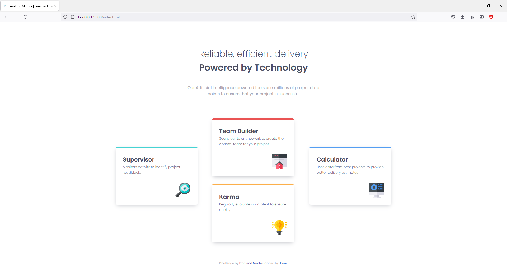

# Frontend Mentor - Four card feature section solution

This is a solution to the [Four card feature section challenge on Frontend Mentor](https://www.frontendmentor.io/challenges/four-card-feature-section-weK1eFYK). Frontend Mentor challenges help you improve your coding skills by building realistic projects. 

## Table of contents

- [Overview](#overview)
  - [The challenge](#the-challenge)
  - [Screenshot](#screenshot)
  - [Links](#links)
  - [Built with](#built-with)
  - [What I learned](#what-i-learned)
  - [Continued development](#continued-development)
- [Author](#author)
- [Acknowledgments](#acknowledgments)

## Overview

### The challenge

Users should be able to:

- View the optimal layout for the site depending on their device's screen size

### Screenshot

### Links

- Solution URL: [Add solution URL here](https://your-solution-url.com)
- Live Site URL: [Add live site URL here](https://your-live-site-url.com)

### Built with

- Semantic HTML5 markup
- CSS custom properties
- Flexbox
- Mobile-first workflow

### What I learned

Used this project to strengthen my CSS positioning skills and practice with flexbox. Also got a better understanding of using media queries and responsive web design in general.

### Continued development

Thus far, I have only tried my hands at only HTML and CSS projects. Learning Javascript at the moment. React and python revision to follow later this year hopefully.

## Author

- Website - [Jamil Alhassan](https://github.com/bjamyl)
- Frontend Mentor - [@yourusername](https://www.frontendmentor.io/profile/yourusername)
- Twitter - [@mhyljay](https://www.twitter.com/mhyljay)

## Acknowledgments

- Special thanks to - [@)papi](https://github.com/0papi). For introducing me to frontend mentor challenges and the world of Web development.

